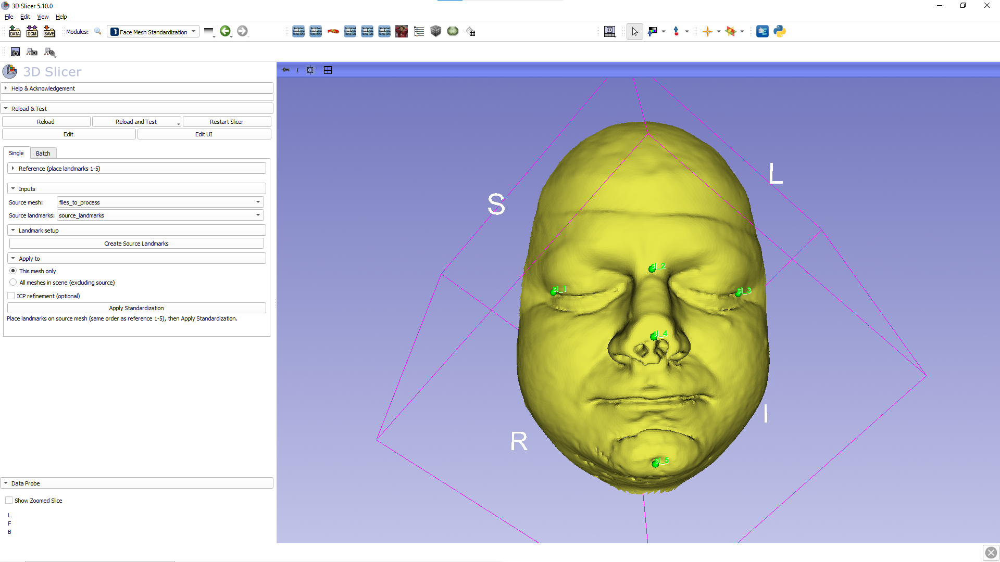
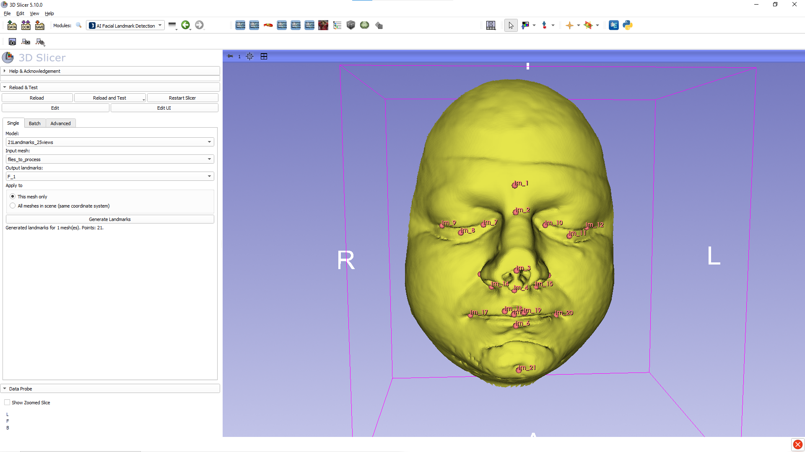

# BioFace3D Landmarking

3D Slicer extension for automatic landmark prediction on 3D facial meshes, with an optional mesh-standardization step that aligns surfaces to the reference space expected by the BioFace3D models.

## Overview

BioFace3D is an end-to-end open-source pipeline for the automated extraction of potential 3D facial biomarkers from MRI scans. As described in the paper, it is organized into three automated modules: **(1)** generation of a 3D facial model from MRI, **(2)** deep learning-based registration of homologous anatomical landmarks, and **(3)** computation of geometric morphometric biomarkers from the resulting landmark coordinates ([Heredia-Lidón *et al.*, 2025](https://doi.org/10.1016/j.cmpb.2025.109010); [software and models](https://bitbucket.org/cv_her_lasalle/bioface3d)).

This extension integrates the BioFace3D landmarking functionality directly into 3D Slicer, enabling facial landmarks to be predicted on surface meshes. It also includes a mesh standardization module that aligns surfaces to the reference space used during model training.

## Face Mesh Standardization

This module aligns a face mesh to the bundled reference using manually placed correspondences, applying a similarity transform (rotation, translation, and uniform scale) with optional ICP refinement so the mesh is closer to the reference space used by the landmarking models.

- **Similarity registration:** Place five homologous seed points on the subject in the same order as reference landmarks 1-5. The module computes a `vtkLandmarkTransform` in similarity mode (rotation, translation, and uniform scale), with optional ICP refinement against the reference surface.
- **Scene mode:** Standardize the selected model or every compatible model in the scene.
- **Batch mode:** Process an input folder using a reference `.fcsv` and write the results to an output folder.

## AI Facial Landmark Detection
This module runs the BioFace3D MVCNN landmarking pipeline inside Slicer. It renders the surface from multiple views, predicts landmark heatmaps for each view, and then combines these predictions into a single set of 3D landmarks on the surface.

- **Models:** The **Model** selector lists the subfolders under `mvcnn/__configs/`. Each configuration predicts a specific landmark set.
- **Single mesh:** Select an input model and an output markups node, then generate landmarks for that mesh or for all compatible meshes in the scene.
- **Batch:** You can also run the same process over input and output directories.
- **Advanced tab:** Shows the current PyTorch backend status, offers installation of GPU-enabled PyTorch from the official CUDA wheel index on supported Windows/Linux NVIDIA systems, and exposes inference controls such as **Max RANSAC Error**, **Mean Predictions**, and **Max Tries**.
- **Python stack:** On first use, Slicer may install PyTorch and SciPy into its own Python environment. If a selected model weight file is not available locally, it is downloaded automatically from the public BioFace3D source repository and then reused from the local cache. Inference is fully local once dependencies and weights are available.

## Requirements

Use a 3D Slicer version compatible with your distribution or Extension Index target. The first run may trigger a sizeable PyTorch download; CUDA wheels are larger.

## Screenshots

Face Mesh Standardization: before and after template alignment.

| Before | After |
|--------|-------|
|  |  |

AI Facial Landmark Detection: result after landmark prediction.

## Citation

If you use BioFace3D methods or software in research, please cite:

> Heredia-Lidón Á, Echeverry-Quiceno LM, González A, Hostalet N, Pomarol-Clotet E, Fortea J, Fatjó-Vilas M, Martínez-Abadías N, Sevillano X; Alzheimer’s Disease Neuroimaging Initiative. BioFace3D: An end-to-end open-source software for automated extraction of potential 3D facial biomarkers from MRI scans. Comput Methods Programs Biomed. 2025 Nov;271:109010. doi: 10.1016/j.cmpb.2025.109010. Epub 2025 Aug 9. PMID: 40818363.

Links: [ScienceDirect](https://www.sciencedirect.com/science/article/pii/S0169260725004274) · [PubMed](https://pubmed.ncbi.nlm.nih.gov/40818363/) · [DOI](https://doi.org/10.1016/j.cmpb.2025.109010)

## License and patents

Released under the [MIT License](LICENSE).

To the best of our knowledge, this extension is not covered by asserted patents. If you are aware of a relevant patent claim, please open an issue so the catalog text can be updated.
